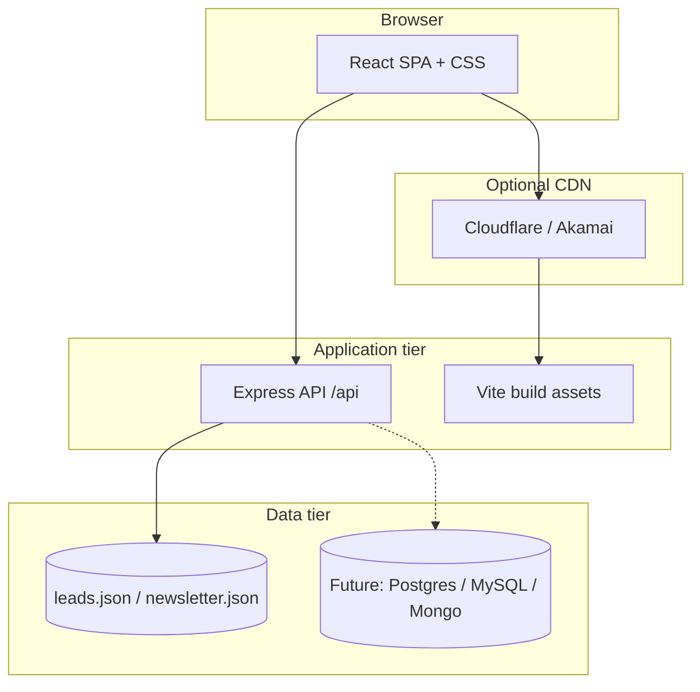

# Architecture — Outpro.India corporate platform

## Overview

The system is a **single-page application (SPA)** built with **React (JavaScript)** and **Vite**, paired with a **Node.js (Express)** API. Production traffic can be served entirely from the Node process (static `client/dist` + `/api/*`) or split between a static host (CDN) and an API host.

## Logical diagram

## Request flow

1. **Navigation** is handled client-side by **React Router**.
2. **Forms** (`/api/contact`, `/api/newsletter`) submit JSON to the API. In development, **Vite proxies** `/api` to the Node server on port 4000.
3. **Content** is currently authored as ES modules under `client/src/data/*.js`. A CMS or database can replace these modules by hydrating the UI from API responses without changing route structure.

## Performance strategy

- **Route-level code splitting** via `React.lazy` and `Suspense` in `App.js`.
- **Image lazy loading** via `LazyImage` (native `loading="lazy"`).
- **Minification** of JS/CSS in production through `vite build`.
- **CDN** recommended for static assets and long-cache headers; tune LCP with hero image priority and compressed formats (WebP/AVIF).

## Security notes (production hardening)

- Add **rate limiting** and **CAPTCHA** on public POST endpoints.
- Move secrets to environment variables; never commit `.env`.
- Restrict **CORS** origins to your production domain(s).
- When persisting to a database, encrypt backups and define retention for PII.
