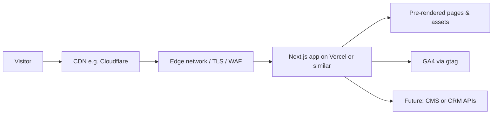

# Technical handover — Outpro.India corporate site

## Architecture (high level)

- **Presentation:** Next.js App Router (`src/app`), React Server Components by default, Tailwind for responsive layout.
- **Content (phase 1):** TypeScript modules under `src/content` act as a lightweight “head” until a CMS or database is introduced.
- **Analytics:** `GoogleAnalytics` reads `NEXT_PUBLIC_GA_MEASUREMENT_ID`. Google Search Console is configured at the domain property level (DNS verification in Google), not in code.

## Tech stack overview

| Layer        | Choice                                      |
| ------------ | ------------------------------------------- |
| Framework    | Next.js 15, React 19, TypeScript            |
| Styling      | Tailwind CSS + CSS variables for brand tokens |
| Hosting      | Vercel / Netlify (static-first deployment)  |
| CDN / DNS    | Cloudflare (recommended) or vendor equivalent |
| Optional API | Node (Next Route Handlers) or Laravel later   |
| Optional DB  | PostgreSQL / MySQL when dynamic forms & CRM sync require it |

## Database schema

No relational database is required for the initial static marketing build. If you add authenticated admin, lead capture, or CMS sync, a typical minimal schema would include:

- `leads(id, name, email, message, source, created_at)`
- `blog_posts(...)` when the blog module ships
- `job_postings(...)` when careers go live

Model these when scope for dynamic data is confirmed.

## Future modules (scalability)

Add routes without restructuring information architecture:

- `/blog` — MDX or CMS-driven listing + `[slug]`.
- `/careers` — job collection from ATS or DB.
- `/partners` — tiered partner narrative + application form.

Navigation is centralized in `src/content/site.ts`.

## Maintenance plan (outline)

- **Security:** keep Node and npm dependencies current (`npm outdated`, Dependabot). Rotate API keys for CRM integrations.
- **Backups:** Git is the source of truth for code; CMS/DB backups per provider policy if added.
- **Bugfix SLA:** agree business hours coverage and severities with stakeholders.
- **Performance reviews:** quarterly Lighthouse run on mobile against production, after major content or third-party script changes.

## User manual (editing)

1. **Global business details:** edit `src/content/site.ts` (name, tagline, email, phone, navigation).
2. **Services:** edit `src/content/services.ts` — each object becomes `/services/[slug]` automatically when `slug` matches `generateStaticParams`.
3. **Portfolio and testimonials:** edit `src/content/portfolio.ts` and `src/content/testimonials.ts`.
4. **Leadership / team:** edit `src/content/people.ts`.
5. **Brand colors / type:** adjust CSS variables in `src/app/globals.css` to match approved Figma tokens; align Tailwind extensions in `tailwind.config.ts` if you add named scales.

After edits, run `npm run lint` and `npm run build` before deploying.
